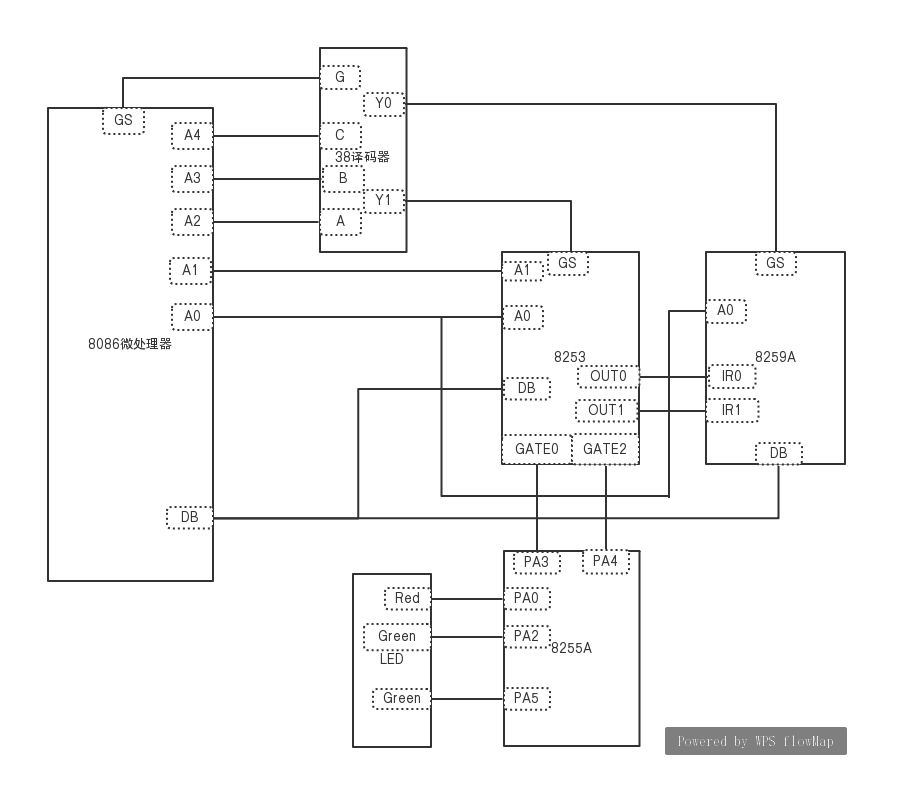
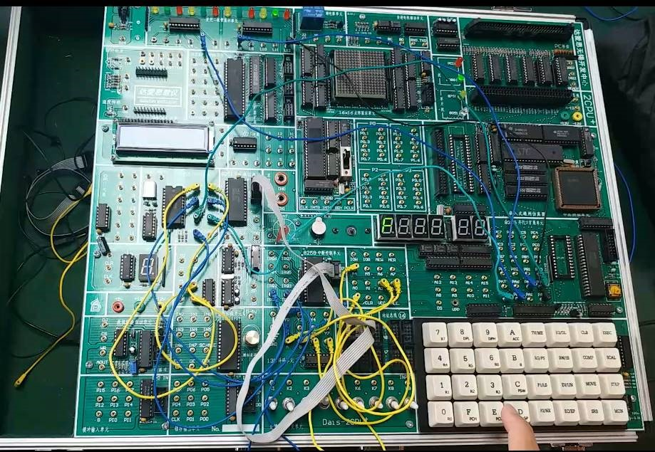

# 简易计算器-硬件版

+ 硬件工程师综合训练项目
+ 日期：2019年7月
+ 团队项目：3人

## 题目要求

1. 通过小键盘输入数据和运算符，完成加、减、乘运算。左侧四个数码管用于输入数据和结果数据的显示。

2. 按键规定

   ⑴ 数字用小键盘0~9输入。 

   ⑵ 功能按键设定： 

   “A”——“+” 

   “B”——“-” 

   “C”——“*”

   “D”——“括号” 

   “E”——“=” 

   “F”——开始运算（包括撤消运算），屏幕显示“0”。 

3. 运算要求

   ⑴ 输入待计算数据（小于四位数），数码管跟随显示。 

   ⑵ 按“+”、“-”、“*”或“括号”时，当前显示内容不变。 

   ⑶ 再输入数据时，数码管跟随显示。 

   ⑷ 按“E”时，显示最终结果数据。若计算结果为奇数，则点亮1个红色发光二极管，并持续以1秒间隔（硬件实现）闪烁；若计算结果为偶数，则点亮2个绿色发光二极管，并持续以2秒间隔（硬件实现）闪烁。

   ⑸ 按“F”键：左侧四个数码管中最右边（对应个位数）的一个显示“0”，其余三个不显示内容。同时熄灭点亮的发光二极管，等待下一次运算的开始。 

   ⑹ 需要考虑运算的优先级问题。 

   ⑺ 可以只考虑正整数运算，不考虑负数和实

**说明：** 

输入数据时，若超出显示范围则不响应超出部分。在计算结果超出显示范围时，则显示“F”。 

## 模块设计

设计框架主要划分为三个模块： 输入模块、 运算模块、 输出模块。
**输入模块**：接收键盘输入字符并进行报错显示，最终存储运算表达式。

**运算模块**：对输入模块得到的表达式进行运算，最终将计算结果存储。

**输出模块**：分析运算模块的计算结果，将结果显示，包括数码管显示和发光二极管闪烁。

个人主要负责`输出模块`, 输出模块芯片连接图如下图所示

实验箱图片

